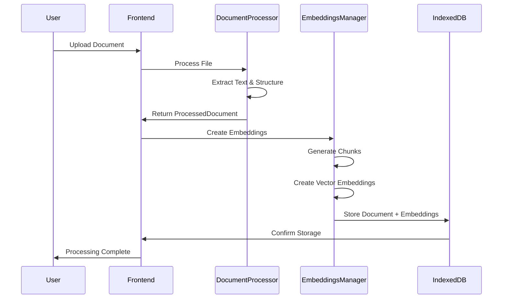
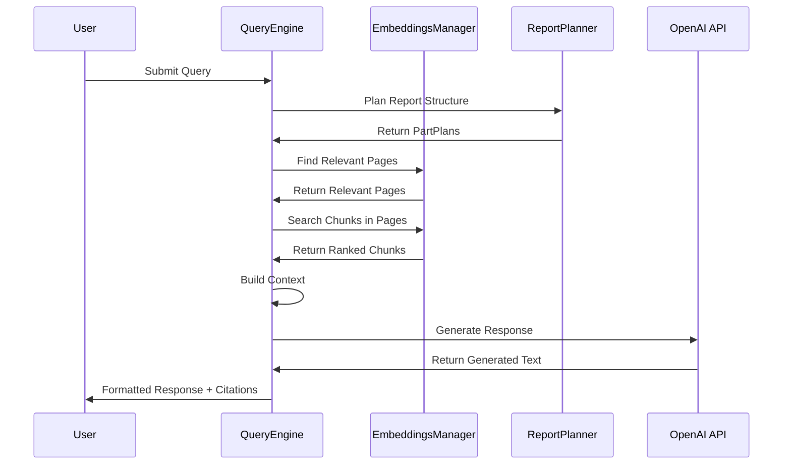

# RAG Documents System - Architecture

Technical documentation describing the system architecture, components, and implementation details of the RAG Documents System.

## 🌍 Language / Язык

[🇺🇸 English](ARCHITECTURE.md) | [🇷🇺 Русский](ARCHITECTURE.ru.md)

## 📋 Table of Contents

- [System Overview](#system-overview)
- [Architecture Patterns](#architecture-patterns)
- [Core Components](#core-components)
- [Data Flow](#data-flow)
- [Storage Architecture](#storage-architecture)
- [API Design](#api-design)
- [Performance Considerations](#performance-considerations)
- [Security Architecture](#security-architecture)

## 🏗️ System Overview

The RAG Documents System is a client-side application built with modern web technologies that provides intelligent document analysis capabilities through retrieval-augmented generation.

### High-Level Architecture

```
┌─────────────────────────────────────────────────────────────┐
│                    Frontend Layer                           │
├─────────────────────────────────────────────────────────────┤
│  Next.js App Router │ React Components │ Tailwind CSS      │
└─────────────────────────────────────────────────────────────┘
                              │
┌─────────────────────────────────────────────────────────────┐
│                 Application Layer                           │
├─────────────────────────────────────────────────────────────┤
│  Document Processor │ RAG Engine │ Research Planner        │
└─────────────────────────────────────────────────────────────┘
                              │
┌─────────────────────────────────────────────────────────────┐
│                   Service Layer                             │
├─────────────────────────────────────────────────────────────┤
│  Embeddings Manager │ Query Engine │ Report Generation     │
└─────────────────────────────────────────────────────────────┘
                              │
┌─────────────────────────────────────────────────────────────┐
│                 Infrastructure Layer                        │
├─────────────────────────────────────────────────────────────┤
│  IndexedDB Storage │ OpenAI API │ Document Processing APIs │
└─────────────────────────────────────────────────────────────┘
```

## 🎯 Architecture Patterns

### 1. Two-Level RAG Architecture

Our system implements a novel dual-storage approach to solve the traditional chunking dilemma:

```
Document Input
      │
      ▼
┌─────────────────┐
│ Document Parser │
└─────────────────┘
      │
      ▼
┌─────────────────┐    ┌─────────────────┐
│   Full Pages    │    │ Semantic Chunks │
│  (Level 1)      │    │   (Level 2)     │
│                 │    │                 │
│ • Complete      │    │ • 1000 tokens   │
│   context       │    │ • Searchable    │
│ • Accurate      │    │ • Embeddings    │
│   citations     │    │ • Fast retrieval│
└─────────────────┘    └─────────────────┘
      │                        │
      └────────┬─────────────────┘
               ▼
    ┌─────────────────┐
    │ Hybrid Retrieval│
    │                 │
    │ 1. Find pages   │
    │ 2. Extract      │
    │    chunks       │
    │ 3. Rank &       │
    │    combine      │
    └─────────────────┘
```

### 2. Modular Component Design

```typescript
// Core interfaces
interface DocumentProcessor {
  process(file: File): Promise<ProcessedDocument>
}

interface EmbeddingsManager {
  createEmbeddings(documents: ProcessedDocument[]): Promise<StoredDocument[]>
  searchSimilar(query: string, options?: SearchOptions): Promise<EmbeddedChunk[]>
}

interface RAGQueryEngine {
  query(question: string, language?: 'ru' | 'en'): Promise<RAGResponse>
}
```

### 3. Event-Driven Processing

```typescript
// Progress tracking and state management
interface ProgressCallback {
  (progress: { current: number; total: number; stage: string }): void
}

// Reactive state updates
const [processingState, setProcessingState] = useState<ProcessingState>()
```

## 🧩 Core Components

### 1. Document Processor (`src/lib/documentProcessor.ts`)

**Responsibility**: Parse and extract content from various document formats

```typescript
interface ProcessedDocument {
  filename: string;
  sections: ProcessedSection[];
  fullPages: FullPage[];
  metadata: DocumentMetadata;
}

interface ProcessedSection {
  sectionNumber: number;
  sectionType: 'page' | 'paragraph' | 'sheet' | 'line';
  content: string;
}
```

**Supported Formats**:
- **PDF**: Using PDF.js for text extraction and page structure
- **DOCX**: Using Mammoth.js for Word document processing
- **XLSX**: Using XLSX library for spreadsheet data extraction

**Key Features**:
- Preserves document structure and page boundaries
- Extracts metadata (creation date, author, etc.)
- Handles multi-page documents with proper pagination
- Error handling for corrupted or unsupported files

### 2. Embeddings Manager (`src/lib/embeddings.ts`)

**Responsibility**: Generate and manage vector embeddings for semantic search

```typescript
interface EmbeddedChunk {
  id: string;
  content: string;
  embedding: number[];
  metadata: ChunkMetadata;
}

interface ChunkMetadata {
  filename: string;
  sectionNumber: number;
  sectionType: string;
  tokens: number;
  hierarchy: HierarchyInfo;
}
```

**Key Features**:
- Chunk text into optimal sizes (1000 tokens)
- Generate embeddings using OpenAI's `text-embedding-3-small`
- Batch processing for rate limit compliance
- Hierarchical context preservation
- Efficient vector similarity search

### 3. RAG Query Engine (`src/lib/ragQuery.ts`)

**Responsibility**: Orchestrate the retrieval and generation process

```typescript
interface RAGResponse {
  answer: string;
  sources: SourceAttribution[];
  tokensUsed: number;
  cost: number;
}
```

**Query Processing Pipeline**:
1. **Query Analysis**: Understand intent and extract keywords
2. **Retrieval Planning**: Determine optimal search strategy
3. **Hierarchical Search**: Find relevant pages, then chunks
4. **Context Building**: Combine full pages and chunks
5. **Generation**: Use GPT-4o for answer generation
6. **Post-processing**: Format response with citations

### 4. Research Planner (`src/services/reportPlanner.ts`)

**Responsibility**: Plan and structure multi-part research reports

```typescript
interface ReportPlan {
  topic: string;
  length: LengthRequest;
  parts: PartPlan[];
}

interface PartPlan {
  index: number;
  title: string;
  tokens: number;
  keywords: string[];
}
```

**Planning Algorithm**:
- Detect explicit part structure in user requests
- Generate logical report sections
- Allocate token budgets across parts
- Create focus keywords for targeted retrieval

## 📊 Data Flow

### Document Upload and Processing



### Query Processing and Response Generation



## 💾 Storage Architecture

### IndexedDB Schema

```typescript
interface StoredDocument {
  id: string;                    // Primary key
  filename: string;              // Original filename
  chunks: EmbeddedChunk[];       // Vector embeddings
  fullPages: FullPage[];         // Complete page content
  createdAt: string;             // Timestamp
}

// Storage operations
class IndexedDBStorage {
  async saveDocuments(documents: StoredDocument[]): Promise<void>
  async loadAllDocuments(): Promise<StoredDocument[]>
  async removeDocument(filename: string): Promise<void>
  async clearAll(): Promise<void>
}
```

### Storage Strategy

**Dual Storage Approach**:
1. **IndexedDB** (Primary): Large documents, unlimited storage
2. **LocalStorage** (Fallback): Small documents, 5MB limit

**Data Optimization**:
- Efficient vector storage with Float32Arrays
- Compressed metadata structures
- Lazy loading for large collections
- Automatic cleanup of orphaned data

## 🔌 API Design

### OpenAI Integration

```typescript
// Embeddings API
const embedding = await openai.embeddings.create({
  model: 'text-embedding-3-small',
  input: text
});

// Chat Completions API
const response = await openai.chat.completions.create({
  model: 'gpt-4o',
  temperature: 0.6,
  max_tokens: maxTokens,
  messages: [
    { role: 'system', content: systemPrompt },
    { role: 'user', content: userPrompt }
  ]
});
```

### Rate Limiting Strategy

```typescript
class RateLimiter {
  private async delayIfNeeded(): Promise<void> {
    // 15 second delay between requests for TPM compliance
    await new Promise(resolve => setTimeout(resolve, 15000));
  }

  private batchSize = 50; // Process embeddings in batches
  private maxContextTokens = 25000; // Safe context limit
}
```

## ⚡ Performance Considerations

### Frontend Optimization

```typescript
// Lazy loading of components
const DocumentManager = lazy(() => import('./DocumentManager'));
const QueryInterface = lazy(() => import('./QueryInterface'));

// Memoization for expensive operations
const memoizedEmbeddingSearch = useMemo(() =>
  embeddings.searchSimilar(query, options),
  [query, options]
);

// Progressive loading for large documents
const useProgressiveLoading = (documents: Document[]) => {
  const [loaded, setLoaded] = useState(0);
  // Load documents in chunks to prevent UI blocking
};
```

### Vector Search Optimization

```typescript
// Efficient similarity calculation
private cosineSimilarity(a: number[], b: number[]): number {
  const dotProduct = a.reduce((sum, ai, i) => sum + ai * b[i], 0);
  const magnitudeA = Math.sqrt(a.reduce((sum, ai) => sum + ai * ai, 0));
  const magnitudeB = Math.sqrt(b.reduce((sum, bi) => sum + bi * bi, 0));
  return dotProduct / (magnitudeA * magnitudeB);
}

// Hierarchical search for better performance
async findRelevantPages(query: string, topK: number): Promise<FullPage[]> {
  // First find pages by averaging chunk similarities
  // Then return only relevant pages for detailed search
}
```

### Memory Management

```typescript
// Efficient chunk processing
private prioritiseChunksByDocument(chunks: EmbeddedChunk[]): EmbeddedChunk[] {
  // Distribute chunks across documents for balanced representation
  // Prioritize high-quality chunks while maintaining diversity
}

// Context window management
private buildContext(chunks: EmbeddedChunk[], pages: FullPage[], tokenBudget: number) {
  // Dynamically allocate tokens between pages and chunks
  // Ensure context fits within model limits
}
```

## 🔒 Security Architecture

### Data Protection

```typescript
// Client-side only processing
const SECURITY_PRINCIPLES = {
  dataLocality: 'All documents processed locally in browser',
  noServerStorage: 'No document content sent to external servers',
  apiKeyManagement: 'OpenAI key stored in environment variables',
  encryptedStorage: 'IndexedDB data encrypted at rest'
};
```

### API Security

```typescript
// Safe API usage
class SecureAPIClient {
  constructor(apiKey: string) {
    this.openai = new OpenAI({
      apiKey,
      dangerouslyAllowBrowser: true, // Controlled environment
      maxRetries: 3,
      timeout: 30000
    });
  }

  // Rate limiting and error handling
  private async safeAPICall<T>(operation: () => Promise<T>): Promise<T> {
    try {
      await this.rateLimiter.wait();
      return await operation();
    } catch (error) {
      this.handleAPIError(error);
      throw error;
    }
  }
}
```

### Input Sanitization

```typescript
// Secure document processing
private sanitizeContent(content: string): string {
  // Remove potentially malicious content
  // Escape special characters
  // Validate file formats
  return cleanContent;
}

// Query validation
private validateQuery(query: string): boolean {
  // Length limits
  // Content filtering
  // Injection prevention
  return isValid;
}
```

## 🔧 Configuration Management

### Environment Configuration

```typescript
interface AppConfig {
  openai: {
    apiKey: string;
    models: {
      embedding: 'text-embedding-3-small';
      generation: 'gpt-4o';
    };
    limits: {
      maxTokensPerRequest: number;
      contextWindow: number;
      rateLimitDelay: number;
    };
  };

  storage: {
    indexedDB: boolean;
    fallbackToLocalStorage: boolean;
    maxDocumentSize: number;
  };

  processing: {
    chunkSize: number;
    batchSize: number;
    overlapPercentage: number;
  };
}
```

## 📈 Monitoring and Observability

### Performance Metrics

```typescript
interface PerformanceMetrics {
  documentProcessing: {
    averageProcessingTime: number;
    embeddingGenerationTime: number;
    storageOperationTime: number;
  };

  queryPerformance: {
    searchLatency: number;
    generationTime: number;
    totalResponseTime: number;
  };

  resourceUsage: {
    memoryConsumption: number;
    storageUtilization: number;
    apiCallsPerSession: number;
  };
}
```

### Error Tracking

```typescript
class ErrorTracker {
  logError(error: Error, context: string) {
    console.error(`[${context}] ${error.message}`, {
      stack: error.stack,
      timestamp: new Date().toISOString(),
      userAgent: navigator.userAgent
    });
  }

  trackPerformance(operation: string, duration: number) {
    console.log(`Performance: ${operation} took ${duration}ms`);
  }
}
```

## 🚀 Deployment Architecture

### Build Configuration

```typescript
// next.config.ts
const nextConfig = {
  output: 'export',           // Static export for client-side deployment
  trailingSlash: true,        // Compatibility with static hosts
  images: { unoptimized: true }, // No server-side image optimization

  webpack: (config) => {
    // PDF.js worker configuration
    config.resolve.alias.canvas = false;
    return config;
  }
};
```

### Deployment Targets

- **Netlify**: Static site hosting with edge functions
- **Vercel**: Serverless deployment with automatic optimization
- **GitHub Pages**: Simple static hosting
- **Self-hosted**: Custom server deployment

---

## 📚 Technical Specifications

### System Requirements

**Client-side**:
- Modern browser with ES2020 support
- IndexedDB support (98%+ browser compatibility)
- Minimum 4GB RAM for large document processing
- Local storage quota of 50MB+ available

**Development**:
- Node.js 18.17.0 or higher
- npm 9.0.0 or higher
- TypeScript 5.0+
- Modern IDE with TypeScript support

### Browser Compatibility

| Browser | Version | Support Level |
|---------|---------|---------------|
| Chrome  | 90+     | Full Support  |
| Firefox | 88+     | Full Support  |
| Safari  | 14+     | Full Support  |
| Edge    | 90+     | Full Support  |

---

*This architecture documentation is maintained by the development team and updated with each major release.*