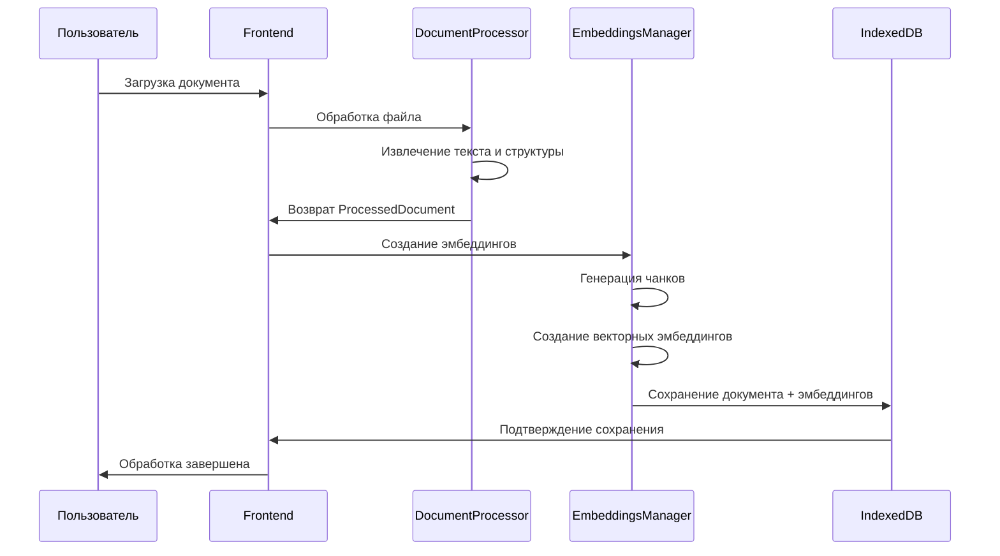
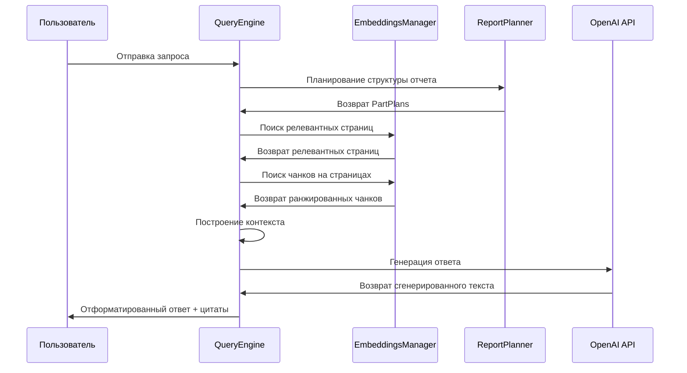

# RAG Documents System - Архитектура

Техническая документация, описывающая архитектуру системы, компоненты и детали реализации RAG Documents System.

## 🌍 Language / Язык

[🇺🇸 English](ARCHITECTURE.md) | [🇷🇺 Русский](ARCHITECTURE.ru.md)

## 📋 Оглавление

- [Обзор системы](#обзор-системы)
- [Архитектурные паттерны](#архитектурные-паттерны)
- [Основные компоненты](#основные-компоненты)
- [Поток данных](#поток-данных)
- [Архитектура хранения](#архитектура-хранения)
- [Дизайн API](#дизайн-api)
- [Соображения производительности](#соображения-производительности)
- [Архитектура безопасности](#архитектура-безопасности)

## 🏗️ Обзор системы

RAG Documents System - это клиентское приложение, построенное на современных веб-технологиях, которое обеспечивает возможности интеллектуального анализа документов через retrieval-augmented generation.

### Высокоуровневая архитектура

```
┌─────────────────────────────────────────────────────────────┐
│                    Слой Frontend                            │
├─────────────────────────────────────────────────────────────┤
│  Next.js App Router │ React Components │ Tailwind CSS      │
└─────────────────────────────────────────────────────────────┘
                              │
┌─────────────────────────────────────────────────────────────┐
│                 Слой приложения                             │
├─────────────────────────────────────────────────────────────┤
│  Document Processor │ RAG Engine │ Research Planner        │
└─────────────────────────────────────────────────────────────┘
                              │
┌─────────────────────────────────────────────────────────────┐
│                   Слой сервисов                             │
├─────────────────────────────────────────────────────────────┤
│  Embeddings Manager │ Query Engine │ Report Generation     │
└─────────────────────────────────────────────────────────────┘
                              │
┌─────────────────────────────────────────────────────────────┐
│                 Слой инфраструктуры                         │
├─────────────────────────────────────────────────────────────┤
│  IndexedDB Storage │ OpenAI API │ Document Processing APIs │
└─────────────────────────────────────────────────────────────┘
```

## 🎯 Архитектурные паттерны

### 1. Двухуровневая RAG архитектура

Наша система реализует новый подход двойного хранения для решения традиционной дилеммы разбиения:

```
Входной документ
      │
      ▼
┌─────────────────┐
│ Парсер документа│
└─────────────────┘
      │
      ▼
┌─────────────────┐    ┌─────────────────┐
│ Полные страницы │    │Семантич. чанки  │
│   (Уровень 1)   │    │   (Уровень 2)   │
│                 │    │                 │
│ • Полный        │    │ • 1000 токенов  │
│   контекст      │    │ • Поисковые     │
│ • Точные        │    │ • Эмбеддинги    │
│   цитаты        │    │ • Быстрый поиск │
└─────────────────┘    └─────────────────┘
      │                        │
      └────────┬─────────────────┘
               ▼
    ┌─────────────────┐
    │ Гибридный поиск │
    │                 │
    │ 1. Найти        │
    │    страницы     │
    │ 2. Извлечь      │
    │    чанки        │
    │ 3. Ранжировать  │
    │    и объединить │
    └─────────────────┘
```

### 2. Модульный дизайн компонентов

```typescript
// Основные интерфейсы
interface DocumentProcessor {
  process(file: File): Promise<ProcessedDocument>
}

interface EmbeddingsManager {
  createEmbeddings(documents: ProcessedDocument[]): Promise<StoredDocument[]>
  searchSimilar(query: string, options?: SearchOptions): Promise<EmbeddedChunk[]>
}

interface RAGQueryEngine {
  query(question: string, language?: 'ru' | 'en'): Promise<RAGResponse>
}
```

### 3. Событийно-ориентированная обработка

```typescript
// Отслеживание прогресса и управление состоянием
interface ProgressCallback {
  (progress: { current: number; total: number; stage: string }): void
}

// Реактивные обновления состояния
const [processingState, setProcessingState] = useState<ProcessingState>()
```

## 🧩 Основные компоненты

### 1. Обработчик документов (`src/lib/documentProcessor.ts`)

**Ответственность**: Парсинг и извлечение контента из различных форматов документов

```typescript
interface ProcessedDocument {
  filename: string;
  sections: ProcessedSection[];
  fullPages: FullPage[];
  metadata: DocumentMetadata;
}

interface ProcessedSection {
  sectionNumber: number;
  sectionType: 'page' | 'paragraph' | 'sheet' | 'line';
  content: string;
}
```

**Поддерживаемые форматы**:
- **PDF**: Использование PDF.js для извлечения текста и структуры страниц
- **DOCX**: Использование Mammoth.js для обработки документов Word
- **XLSX**: Использование библиотеки XLSX для извлечения данных электронных таблиц

**Ключевые функции**:
- Сохраняет структуру документа и границы страниц
- Извлекает метаданные (дата создания, автор и т.д.)
- Обрабатывает многостраничные документы с правильной пагинацией
- Обработка ошибок для поврежденных или неподдерживаемых файлов

### 2. Менеджер эмбеддингов (`src/lib/embeddings.ts`)

**Ответственность**: Генерация и управление векторными эмбеддингами для семантического поиска

```typescript
interface EmbeddedChunk {
  id: string;
  content: string;
  embedding: number[];
  metadata: ChunkMetadata;
}

interface ChunkMetadata {
  filename: string;
  sectionNumber: number;
  sectionType: string;
  tokens: number;
  hierarchy: HierarchyInfo;
}
```

**Ключевые функции**:
- Разбиение текста на оптимальные размеры (1000 токенов)
- Генерация эмбеддингов с использованием `text-embedding-3-small` OpenAI
- Пакетная обработка для соблюдения лимитов скорости
- Сохранение иерархического контекста
- Эффективный векторный поиск по сходству

### 3. RAG Query Engine (`src/lib/ragQuery.ts`)

**Ответственность**: Оркестрация процесса поиска и генерации

```typescript
interface RAGResponse {
  answer: string;
  sources: SourceAttribution[];
  tokensUsed: number;
  cost: number;
}
```

**Пайплайн обработки запросов**:
1. **Анализ запроса**: Понимание намерения и извлечение ключевых слов
2. **Планирование поиска**: Определение оптимальной стратегии поиска
3. **Иерархический поиск**: Поиск релевантных страниц, затем чанков
4. **Построение контекста**: Объединение полных страниц и чанков
5. **Генерация**: Использование GPT-4o для генерации ответа
6. **Постобработка**: Форматирование ответа с цитатами

### 4. Планировщик исследований (`src/services/reportPlanner.ts`)

**Ответственность**: Планирование и структурирование многочастных исследовательских отчетов

```typescript
interface ReportPlan {
  topic: string;
  length: LengthRequest;
  parts: PartPlan[];
}

interface PartPlan {
  index: number;
  title: string;
  tokens: number;
  keywords: string[];
}
```

**Алгоритм планирования**:
- Обнаружение явной структуры частей в пользовательских запросах
- Генерация логических разделов отчета
- Распределение бюджетов токенов по частям
- Создание фокусных ключевых слов для целевого поиска

## 📊 Поток данных

### Загрузка и обработка документов



### Обработка запросов и генерация ответов



## 💾 Архитектура хранения

### Схема IndexedDB

```typescript
interface StoredDocument {
  id: string;                    // Первичный ключ
  filename: string;              // Исходное имя файла
  chunks: EmbeddedChunk[];       // Векторные эмбеддинги
  fullPages: FullPage[];         // Полный контент страниц
  createdAt: string;             // Временная метка
}

// Операции хранения
class IndexedDBStorage {
  async saveDocuments(documents: StoredDocument[]): Promise<void>
  async loadAllDocuments(): Promise<StoredDocument[]>
  async removeDocument(filename: string): Promise<void>
  async clearAll(): Promise<void>
}
```

### Стратегия хранения

**Подход двойного хранения**:
1. **IndexedDB** (Основное): Большие документы, неограниченное хранение
2. **LocalStorage** (Резервное): Маленькие документы, лимит 5МБ

**Оптимизация данных**:
- Эффективное векторное хранение с Float32Arrays
- Сжатые структуры метаданных
- Ленивая загрузка для больших коллекций
- Автоматическая очистка потерянных данных

## 🔌 Дизайн API

### Интеграция с OpenAI

```typescript
// API эмбеддингов
const embedding = await openai.embeddings.create({
  model: 'text-embedding-3-small',
  input: text
});

// API завершения чата
const response = await openai.chat.completions.create({
  model: 'gpt-4o',
  temperature: 0.6,
  max_tokens: maxTokens,
  messages: [
    { role: 'system', content: systemPrompt },
    { role: 'user', content: userPrompt }
  ]
});
```

### Стратегия ограничения скорости

```typescript
class RateLimiter {
  private async delayIfNeeded(): Promise<void> {
    // 15-секундная задержка между запросами для соблюдения TPM
    await new Promise(resolve => setTimeout(resolve, 15000));
  }

  private batchSize = 50; // Обработка эмбеддингов пакетами
  private maxContextTokens = 25000; // Безопасный лимит контекста
}
```

## ⚡ Соображения производительности

### Оптимизация Frontend

```typescript
// Ленивая загрузка компонентов
const DocumentManager = lazy(() => import('./DocumentManager'));
const QueryInterface = lazy(() => import('./QueryInterface'));

// Мемоизация для дорогих операций
const memoizedEmbeddingSearch = useMemo(() =>
  embeddings.searchSimilar(query, options),
  [query, options]
);

// Прогрессивная загрузка для больших документов
const useProgressiveLoading = (documents: Document[]) => {
  const [loaded, setLoaded] = useState(0);
  // Загрузка документов частями для предотвращения блокировки UI
};
```

### Оптимизация векторного поиска

```typescript
// Эффективный расчет сходства
private cosineSimilarity(a: number[], b: number[]): number {
  const dotProduct = a.reduce((sum, ai, i) => sum + ai * b[i], 0);
  const magnitudeA = Math.sqrt(a.reduce((sum, ai) => sum + ai * ai, 0));
  const magnitudeB = Math.sqrt(b.reduce((sum, bi) => sum + bi * bi, 0));
  return dotProduct / (magnitudeA * magnitudeB);
}

// Иерархический поиск для лучшей производительности
async findRelevantPages(query: string, topK: number): Promise<FullPage[]> {
  // Сначала найти страницы по усредненным сходствам чанков
  // Затем вернуть только релевантные страницы для детального поиска
}
```

### Управление памятью

```typescript
// Эффективная обработка чанков
private prioritiseChunksByDocument(chunks: EmbeddedChunk[]): EmbeddedChunk[] {
  // Распределение чанков по документам для сбалансированного представления
  // Приоритет высококачественных чанков при сохранении разнообразия
}

// Управление контекстным окном
private buildContext(chunks: EmbeddedChunk[], pages: FullPage[], tokenBudget: number) {
  // Динамическое распределение токенов между страницами и чанками
  // Обеспечение соответствия контекста лимитам модели
}
```

## 🔒 Архитектура безопасности

### Защита данных

```typescript
// Обработка только на клиентской стороне
const SECURITY_PRINCIPLES = {
  dataLocality: 'Все документы обрабатываются локально в браузере',
  noServerStorage: 'Содержимое документов не отправляется на внешние серверы',
  apiKeyManagement: 'Ключ OpenAI хранится в переменных окружения',
  encryptedStorage: 'Данные IndexedDB зашифрованы в покое'
};
```

### Безопасность API

```typescript
// Безопасное использование API
class SecureAPIClient {
  constructor(apiKey: string) {
    this.openai = new OpenAI({
      apiKey,
      dangerouslyAllowBrowser: true, // Контролируемая среда
      maxRetries: 3,
      timeout: 30000
    });
  }

  // Ограничение скорости и обработка ошибок
  private async safeAPICall<T>(operation: () => Promise<T>): Promise<T> {
    try {
      await this.rateLimiter.wait();
      return await operation();
    } catch (error) {
      this.handleAPIError(error);
      throw error;
    }
  }
}
```

### Санитизация ввода

```typescript
// Безопасная обработка документов
private sanitizeContent(content: string): string {
  // Удаление потенциально вредоносного контента
  // Экранирование специальных символов
  // Валидация форматов файлов
  return cleanContent;
}

// Валидация запросов
private validateQuery(query: string): boolean {
  // Ограничения длины
  // Фильтрация контента
  // Предотвращение инъекций
  return isValid;
}
```

## 🔧 Управление конфигурацией

### Конфигурация окружения

```typescript
interface AppConfig {
  openai: {
    apiKey: string;
    models: {
      embedding: 'text-embedding-3-small';
      generation: 'gpt-4o';
    };
    limits: {
      maxTokensPerRequest: number;
      contextWindow: number;
      rateLimitDelay: number;
    };
  };

  storage: {
    indexedDB: boolean;
    fallbackToLocalStorage: boolean;
    maxDocumentSize: number;
  };

  processing: {
    chunkSize: number;
    batchSize: number;
    overlapPercentage: number;
  };
}
```

## 📈 Мониторинг и наблюдаемость

### Метрики производительности

```typescript
interface PerformanceMetrics {
  documentProcessing: {
    averageProcessingTime: number;
    embeddingGenerationTime: number;
    storageOperationTime: number;
  };

  queryPerformance: {
    searchLatency: number;
    generationTime: number;
    totalResponseTime: number;
  };

  resourceUsage: {
    memoryConsumption: number;
    storageUtilization: number;
    apiCallsPerSession: number;
  };
}
```

### Отслеживание ошибок

```typescript
class ErrorTracker {
  logError(error: Error, context: string) {
    console.error(`[${context}] ${error.message}`, {
      stack: error.stack,
      timestamp: new Date().toISOString(),
      userAgent: navigator.userAgent
    });
  }

  trackPerformance(operation: string, duration: number) {
    console.log(`Производительность: ${operation} заняло ${duration}мс`);
  }
}
```

## 🚀 Архитектура развертывания

### Конфигурация сборки

```typescript
// next.config.ts
const nextConfig = {
  output: 'export',           // Статический экспорт для клиентского развертывания
  trailingSlash: true,        // Совместимость со статическими хостами
  images: { unoptimized: true }, // Без серверной оптимизации изображений

  webpack: (config) => {
    // Конфигурация воркера PDF.js
    config.resolve.alias.canvas = false;
    return config;
  }
};
```

### Цели развертывания

- **Netlify**: Хостинг статических сайтов с edge функциями
- **Vercel**: Serverless развертывание с автоматической оптимизацией
- **GitHub Pages**: Простой статический хостинг
- **Самостоятельный хостинг**: Развертывание на собственном сервере

---

## 📚 Технические спецификации

### Системные требования

**Клиентская сторона**:
- Современный браузер с поддержкой ES2020
- Поддержка IndexedDB (98%+ совместимость браузеров)
- Минимум 4ГБ ОЗУ для обработки больших документов
- Доступная квота локального хранилища 50МБ+

**Разработка**:
- Node.js 18.17.0 или выше
- npm 9.0.0 или выше
- TypeScript 5.0+
- Современная IDE с поддержкой TypeScript

### Совместимость браузеров

| Браузер | Версия | Уровень поддержки |
|---------|---------|-------------------|
| Chrome  | 90+     | Полная поддержка  |
| Firefox | 88+     | Полная поддержка  |
| Safari  | 14+     | Полная поддержка  |
| Edge    | 90+     | Полная поддержка  |

---

*Эта документация по архитектуре поддерживается командой разработчиков и обновляется с каждым крупным релизом.*